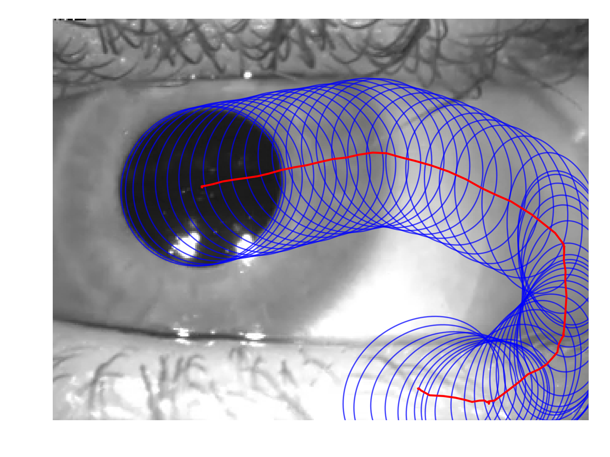
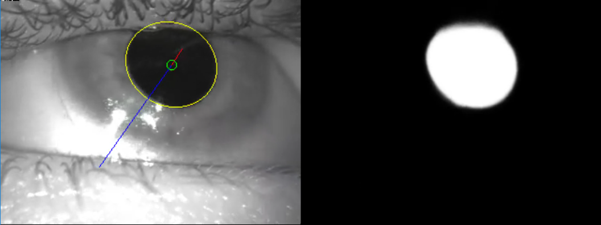

# DeepVOG
<p align="center"> 

</p>
DeepVOG is a framework for pupil segmentation and gaze estimation based on a fully convolutional neural network. Currently it is available for offline gaze estimation of eye-tracking video clips.

## Citation
DeepVOG has been peer-reviewed and accepted as an original article in the Journal of Neuroscience Method (Elsevier). 
The manuscript is available open access and can be downloaded free of charge [here](https://doi.org/10.1016/j.jneumeth.2019.05.016). If you use DeepVOG or some part of the code, please cite (see [bibtex](citations.bib)):

Yiu YH, Aboulatta M, Raiser T, Ophey L, Flanagin VL, zu Eulenburg P, Ahmadi SA. DeepVOG: Open-source Pupil Segmentation and Gaze Estimation in Neuroscience using Deep Learning. Journal of neuroscience methods. vol. 324, 2019, DOI: https://doi.org/10.1016/j.jneumeth.2019.05.016

## Release Notes

DeepVOG v1.1.4 (Date: 31-07-2019, latest)

**Improvements**:
1. Added `--skip_existed` flag for skipping the operation in `--table` mode if the output file already exists
2. Added `--skip_errors` flag for skipping the operation in `--table` mode and continue the next video if error is encountered. 
3. Added `--log_errors` flag for logging the errors and tracebacks in a file for `--table` mode, when error is encountered.
4. Added `--no_gaze` flag for only pupil segmentation in `--infer` mode.
5. One more column (`with_gaze`) to fill in the input csv file for `--table` mode. It enables/disable gaze estimation in `--table` mode.

For details of command line arguments, see [doc/documentation.md](doc/documentation.md)

**Removed**:
1. Text-based User Interface (TUI) is removed.

For release history, see [RELEASE.md](RELEASE.md). Update from existing package can be done via directly copying the source code [deepvog/](deepvog/) to your directory of installed DeepVOG module .

## Getting Started

These instructions will get you a copy of the project up and running on your local machine for development and testing purposes. See deployment for notes on how to deploy the project on a live system.

### Prerequisites

To run DeepVOG, you need to have a Python distribution (we recommend [Anaconda](https://www.anaconda.com/)) and the following Python packages:

```
numpy
scikit-video
scikit-image
tensorflow-gpu
keras
```
As an alternative, you can use our docker image which already includes all the dependencies. The only requirement is a platform installed with nvidia driver and nvidia-docker (or nvidia runtime of docker).

### Installation of Package
A step by step series of examples that tell you how to get DeepVOG running.<br/>
1. Installing from package

```
$ git clone https://github.com/pydsgz/DeepVOG
 (or you can download the files in this repo with your browser)
```
Move to the directory of DeepVOG that you just cloned/downloaded, and type
```
$ python setup.py install
```
If it happens to be missing some dependencies listed above, you may install them with pip: <br/>
```
$ pip install numpy
$ pip install scikit-video
$ ...
```
2. It is highly recommended to run our program in docker. You can directly pull our docker image from dockerhub. (For tutorials on docker, see [docker](https://docs.docker.com/install/) and [nvidia-docker](https://github.com/NVIDIA/nvidia-docker))

```
$ docker run --runtime=nvidia -it --rm yyhhoi/deepvog:v1.1.4 bash
or
$ nvidia-docker run -it --rm yyhhoi/deepvog:v1.1.4 bash
```

### Removal of Package

Removal can be done by simply deleting the python package, for example:
```
$ rm -r /usr/local/lib/python3.5/dist-packages/deepvog-1.1.2-py3.5.egg
``` 
The exact path will depend on where you store your installed python package, and the version of deepvog and python. 


### Usage (Command-line interface)
The CLI allows you to fit/infer single video, or multiple of them by importing a csv table. They can be simply called by:
```
$ python -m deepvog --fit /PATH/video_fit.mp4 /PATH/eyeball_model.json
$ python -m deepvog --infer /PATH/video_infer.mp4 /PATH/eyeball_model.json /PATH/results.csv
$ python -m deepvog --table /PATH/list_of_operations.csv
```
DeepVOG first fits a 3D eyeball model from a video clip. Base on the eyeball model, it estimates the gaze direction on any other videos if the relative position of the eye with respect to the camera remains the same. It has no problem that you fit an eyeball model and infer the gaze directions from the same video clip. However, for clinical use, some users may want to have a more accurate estimate by having a separate fitting clip where the subjects perform a calibration paradigm. <br/>

In addition, you will need to specify your camera parameters such as focal length, if your parameters differ from default values.
```
$ python -m deepvog --fit /PATH/video_fit.mp4 /PATH/eyeball_model.json --flen 12 --vid-shape 240,320 --sensor 3.6,4.8 --batchsize 32 --gpu 0
```
Please refer to [doc/documentation.md](doc/documentation.md) for the meaning of arguments and input/output formats. Alternatively, you can also type `$ python -m deepvog -h` for usage examples.


### Usage (As a python module)
For more flexibility, you may import the module directly in python.
```python
import deepvog

# Load our pre-trained network
model = deepvog.load_DeepVOG()

# Initialize the class. It requires information of your camera's focal length and sensor size, which should be available in product manual.
inferer = deepvog.gaze_inferer(model, focal_length, video_shape, sensor_size) 

# Fit an eyeball model from "demo.mp4". The model will be stored as the "inferer" instance's attribute.
inferer.process("demo.mp4", mode="Fit")

# After fitting, infer gaze from "demo.mp4" and output the results into "demo_result.csv"
inferer.process("demo.mp4", mode="Infer", output_record_path="demo_results.csv")

# Optional

# You may also save the eyeball model to "demo_model.json" for subsequent gaze inference
inferer.save_eyeball_model("demo_model.json") 

# By loading the eyeball model, you don't need to fit the model again
inferer.load_eyeball_model("demo_model.json") 

```

## Demo

Demo video is located at [demo](demo). After installing DeepVOG, you can move to that directory and run the following commands:

```
$ python -m deepvog --fit ./demo.mp4 ./demo_eyeball_model.json -v ./demo_visualization_fitting.mp4 -m -b 256
$ python -m deepvog --infer ./demo.mp4 ./demo_eyeball_model.json ./demo_gaze_results.csv -b 32 -v ./demo_visualization_inference.mp4 -m
```

The -v argument draws the visualization of fitted ellipse and gaze vector to a designated video. The -m argument draws the segmented heatmap of pupil side by side. The -b argument controls the batch size. For more details of arguments, see [doc/documentation.md](doc/documentation.md).

In the results, you should be able to see the visualization in the generated video "demo_visualization_inference.mp4", as shown below.

<p align="center"> 

</p>

In addtion, you can also test out the --table mode by:
```
$ python -m deepvog --table demo_table_mode.csv
```

## Limitations

DeepVOG is intended for pupil segmentation and gaze estimation under the assumptions below:

1. Video contains only single eye features (pupil, iris, eyebrows, eyelashes, eyelids...etc), for example the [demo video](demo). Videos with facial or body features may compromise its accuracy.
2. DeepVOG was intended for eye video recorded by head-mounted camera. Hence, It assumes fixed relative position of the eye with respect to the camera.  

For more detailed discussion of the underlying assumptions of DeepVOG, please refer to the [paper](https://doi.org/10.1016/j.jneumeth.2019.05.016).  

## Annotation tools
See [annotation_tool/README.md](annotation_tool/README.md).


## Authors

* **Yiu Yuk Hoi** - *Implementation and validation*
* **Seyed-Ahmad Ahmadi** - *Research study concept*
* **Moustafa Aboulatta** - *Initial work*

## Links to other related papers
- [U-Net: Convolutional Networks for Biomedical Image Segmentation
](https://arxiv.org/abs/1505.04597)
- [V-Net: Fully Convolutional Neural Networks for Volumetric Medical Image Segmentation](https://arxiv.org/abs/1606.04797)
- [A fully-automatic, temporal approach to single camera, glint-free 3D eye model fitting](https://www.cl.cam.ac.uk/research/rainbow/projects/eyemodelfit/)

## License

This project is licensed under the GNU General Public License v3.0 (GNU GPLv3) License - see the [LICENSE](LICENSE) file for details

## Acknowledgments

We thank our fellow researchers at the German Center for Vertigo and Balance Disorders for help in acquiring data for training and validation of pupil segmentation and gaze estimation. In particular, we would like to thank Theresa Raiser, Dr. Virginia Flanagin and Prof. Dr. Peter zu Eulenburg.

DeepVOG was created with support from the German Federal Ministry of Education and Research (BMBF) in connection with the foundation of the German Center for Vertigo and Balance Disorders (DSGZ) (grant number 01 EO 0901), and a stipend of the Graduate School of Systemic Neurosciences (DFG-GSC 82/3).
