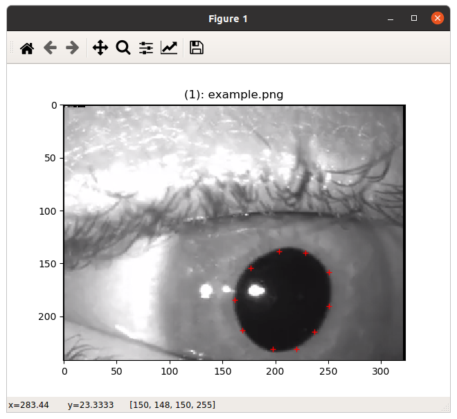
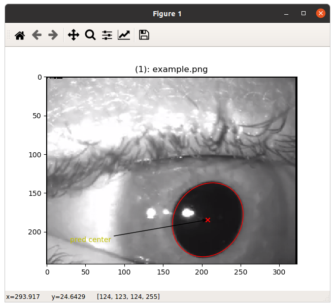

# What is this?
This is an annotation tool that helps you label the pupil area in your pictures. The tool works by fitting an ellipse by clicking on at least 5 points along the pupil boundary. 

 
# How to use
1. Download [annotation_tool.py](annotation_tool.py) and [ellipses.py](ellipses.py) into the same directory. 
2. Run`$ python annotation_tool.py ./path/to/folder_of_your_pupil_pictures`
3. Left click to identify at least 5 points on the pupil boundary

 

4. Right click to fit an ellipse and show the ellipse line.

 

5. The fitting will produce two extra files 'PICTURE_NAME.txt'and 'PICTURE_NAME_points.txt' in the same directory. The former contains the x- and y-coordinates of pupile centre. The latter contains x- and y-coordinates of the annotated points on pupil boundary.

  
The current [annotation_tool.py](annotation_tool.py) only looks for pictures with extension names of .png and .jpg. However, it can be easily extended.  
 

# Acknowledgements

The [annotation_tool.py](annotation_tool.py) was written by our colleague Taha Emre. It is based on an ellipse fitting method published by Radim Hal oy and Jan Flusser, and its python implementation ([ellipses.py](ellipses.py)) by Ben Hammel and Nick Sullivan-Monlina. The latest implementation of the ellipse fitting method can be found in their [Github repository](https://github.com/bdhammel/least-squares-ellipse-fitting/blob/master/ellipse.py).   

# References

oy, Radim Hal and Jan Flusser. “NUMERICALLY STABLE DIRECT LEAST SQUARES FITTING OF ELLIPSES.” (1998).

Ben Hammel, & Nick Sullivan-Molina. (2020, March 21). bdhammel/least-squares-ellipse-fitting: v2.0.0 (Version v2.0.0). Zenodo. http://doi.org/10.5281/zenodo.3723294

